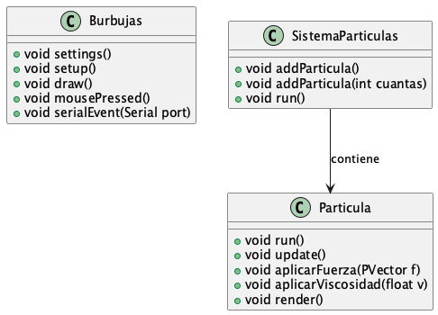

## Documentación con PlantUML. 

Este directorio continene diagramas generados con la herramienta [PlantUML](https://plantuml.com/). Una ventaja de esta herramienta es que los modelos son ficheros de texto (con extensión .puml), creados con la sintaxis que propone esta herramienta y que no es difícil de entender. 

El que sean ficheros de texto permite su generación automática a partir de scripts que analizan el código como el ejemplo sencillo que hay en [scripts](./scripts), que genera el diagrama de clases que se ve más abajo. También pueden ser muy fácilmente generadas por las herramientas actuales de IA, a partir del código. Los diagramas de actividad y de estados que se ven más abajo han sido generados con la ayuda de Github Copilot usando como motor de IA Claude Sonnet 4.  

### Diagrama de clases

Este diagrama de clases se actualiza automáticamente cada vez que se cambian los métodos en  [Burbujas.pde](../Burbujas.pde), [Particula.pde](../Particula.pde) o [SistemaParticulas.pde](../SistemaParticulas.pde), y se hace un commit de dichos cambios, gracias a la combinación de los scripts en [.githooks/](../.githooks/) y en [scripts](../scripts/). 

### Diagrama de actividad

Representa el funcionamiento del programa principal. 

### Diagrama de estados 

Representa los estados de una partícula. 

